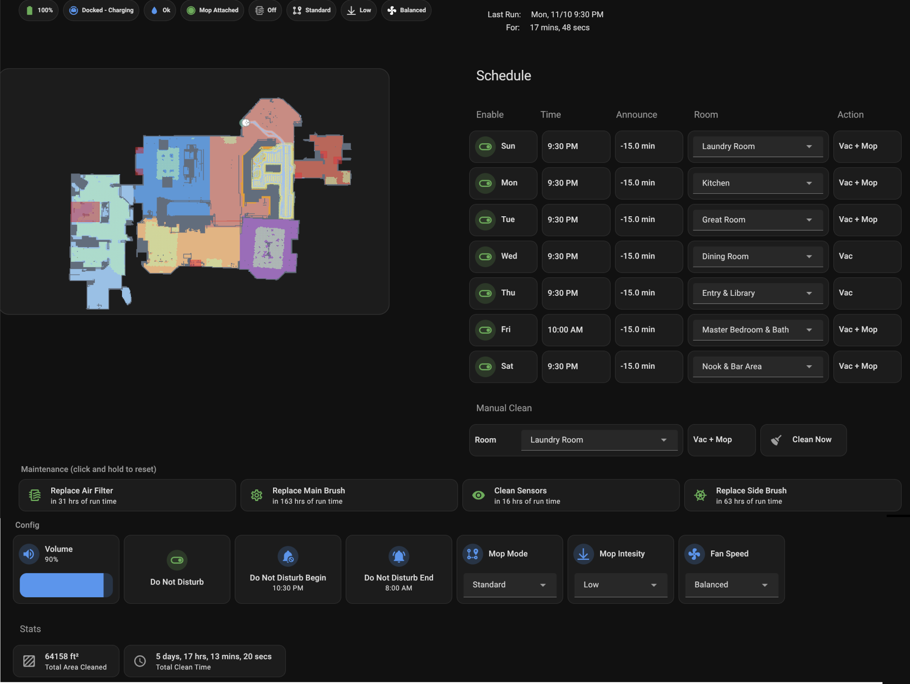

# ha-roborock-control-panel
Instructions and YAML to build a Roborock Vacuum Control Panel in Home Assistant.  This is not just a dashboard, but also the underlying control system that will execute what you set in the panel.



### IMPORTANT:
* This is not an integration or component that you can simply drop in and it works.  You need to follow the lengthy instructions which include: creating HA objects (e.g. helpers), cutting and pasting YAML into HA, and customizing that YAML.
* This repository is provided **as-is** to give you a jump start in building your control panel.
* I cannot make any commitment to long term support of this repository but will try to address question and issues.


### Features
* Display the current settings of the vacuum as badges at the top of the dashboard.
* Display the vacuum's map and track the vacuum on the map when it is running (NOTE: at this time the underlying roborock integration only updates the map image about every 30 seconds.)
* For each day (Sun-Sat):
	* Enable and disable the vacuum run that day.
	* Set the time for the vacuum to run.
	* Set how many minutes before each run to announce that the vacuum is going to start.
	* Set the room to clean.
	* Set what action the vacuum will do: Vac, Mop, or Vac & Mop.
	* At the set time, send cleaning parameters to the vacuum and start it cleaning.
* Show when the vacuum last ran and for how long.
* Ability to manually start the vacuum cleaning a room.
* Announce if the vacuum runs into a problem.
* Show the time until maintenance tasks are due and allow you to reset the task when maintenance is done.
* Change the settings of the vacuum such as volume, do not disturb, mop mode, etc.
* Show basic run statistics of the vacuum.
* Can handle two vacuums with some additional work.

### Prerequisites
* A Roborock vacuum supported by the native Home Assistant Roborock integration
* The vacuum is installed and working via the roborock app.
* Your house map created and rooms defined.
* The Roborock integration is installed and working (you can see the entities and they have values).
* The Mushroom cards installed via HACS.
* An HA version new enough to support the Sections dashboard layout.
* A good understanding of HA concepts like: YAML config, automations, scripts, variables, script fields, helpers, dashboard layouts, etc.
* Developer Tools turned on in HA.
* Any schedules or other automation you have set in the Roborock app turned off so they are not competing with the HA control of the vacuum.

### Limitations
* Only one vacuum run per day
* Only one floor(map) is supported

### Support Vacuums
This framework has only been tested with the following vacuums.  Other Roborock vacuums should work, but may need additional changes not spelled out in the intructions provided. If you use this with another vacuum model please let me know so I can update this list.

```
Roborock QRevo Pro
```

### Installation
The installation is completely manual.  Follow these [instructions](instructions.md).

### How It Works
This section gives an overview of how the vacuum control panel works.  It's not necessary to read this section to install and use it, but it can make it easier by helping you understand what all the parts are doing.

The central part of the automation is a timer that fires every minute.  It triggers an automation called 'Vacuum Run Check'.  This automation first restarts the timer so it will trigger again the next minute.  It then executes three scripts:
```
Vacuum Set Variables
Vacuum Run Announce
Vacuum Run Check
```
A repeating timer is used so that even if HA isn't running or some other issue prevents the vacuum from starting at the specified time, the vacuum functionality will run when HA is back or the issue is fixed (within a time limit.)

##### Vacuum Set Variables

There are 8 sets of helpers that the control panel uses.  One set is called the zero helpers (a.k.a. the current day helpers) (e.g. vacuum_0_clean_mode, vacuum_0_room, etc.)  The other sets correspond to the 7 days of the week (e.g. vacuum_2_monday_clean_mode, vacuum_3_tuesday_clean_mode, etc.) where Sunday is 1 and Saturday is 7.

The 'Vacuum Set Variables' script determines what day it is and copies the values of that day's helpers into the zero helpers.  That way the other scripts can just use the zero helpers and not need tons of conditions checking the day of week.

This script also sets a few other non-day-specific helpers such as vacuum_0_mop_mode, vacuum_0_ran_today, etc.

##### Vacuum Run Announce

This script checks the time of day. If it is in the range of the announce window for the day and the vacuum announcement has not already been made, announces that the robot is going to start cleaning in X minutes.

The announce window is set it the control panel by an offset in minutes before the vacuum run time (e.g. 15 minutes before the vacuum runs).

##### Vacuum Run Check

This script is what actually starts the vacuum for the day if all conditions are met.  Currently the conditions are:

- the current day of the week is enable in control panel
- the current time is in the run window
- the vacuum has not already run
- someone is home (You need to provide the logic for this.)
- the day's room is not set to None.

The run window starts at the time set in the control panel for the day to one hour after that time.

If the conditons are met, then this script executes the script 'Vacuum Clean Room' and sets an input_boolean helper indicating the vacuum has run today.

##### Vacuum Clean Room

This script calls the script 'Vacuum Set Clean Mode' and then starts the vacuum cleaning.  The vacuum is started by using the app_segment_clean command.

##### Vacuum Set Clean Mode

This script sends cleaning settings to the vacuum:

- fan speed (vacuum suction power)
- mop intensity
- mop mode.

The result of this script is that the vacuum will 'bing' three times (or at least that's what happens on my Qrevo Pro).

#### Vacuum Problem Announce (automation)

This automation watches the vacuum and dock error sensors and, if they are triggered, will announce that the vacuum has a problem.  It calls the script 'Vacuum Problem Announce'.

##### Vacuum Problem Announce (script)

This script builds the problem message and announces it. (You need to provide the annoounce logic.)

#### Other Support Scripts
##### Create Vacuum Room Number Map

This script creates the room-name-to-room-ID dictionaries.  See the instructions for details.

##### Vacuum Clean Room Manual

Called when the manual clean option is used.  It simply calls the 'Vacuum Clean Room' script passing a field telling it this is a manual clean.

##### Vacuum Cycle Clean Mode

A helper script used by the cleaning-mode(Action) buttons on the control panel. It cycles the applicable helper between: Vac, Mop, and Vac + Mop.

